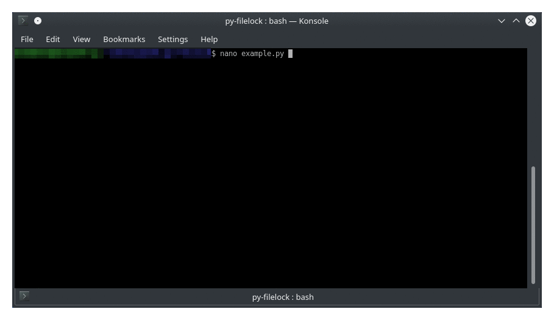

##########
 filelock
##########

A platform-independent file locking library for Python, providing inter-process synchronization:

.. code-block:: python

    from filelock import FileLock

    lock = FileLock("high_ground.txt.lock")
    with lock:
        with open("high_ground.txt", "a") as f:
            f.write("You were the chosen one.")

**************
 Installation
**************

``filelock`` is available via PyPI:

.. code-block:: bash

    python -m pip install filelock

****************
 Learn filelock
****************

.. grid:: 1 2 2 2
    :gutter: 2

    .. grid-item-card::
        **New to file locking?**

        Start with the :doc:`tutorials` to learn the basics through hands-on examples.

    .. grid-item-card::
        **Have a specific task?**

        Check :doc:`how-to` for task-oriented solutions to real-world problems.

    .. grid-item-card::
        **Want to understand the design?**

        Read :doc:`concepts` to explore design decisions and trade-offs.

    .. grid-item-card::
        **Need API details?**

        See the :doc:`api` reference for complete technical documentation.

************
 Lock Types
************

Choose the right lock for your use case:

.. grid:: 1 2 2 2
    :gutter: 2

    .. grid-item-card::
        **FileLock**

        Platform-aware alias. Selects a native backend where available and a soft marker otherwise.

        - ✓ Recommended default
        - ✓ Cancellable acquire
        - ✓ Self-deadlock detection

    .. grid-item-card::
        **SoftFileLock**

        Cooperative file-existence marker. Verify shared-filesystem semantics before deployment.

        - ✓ No native locking API required
        - ✓ Same-host PID inspection
        - ✓ Optional age-based expiry, with overlap risk

    .. grid-item-card::
        **StrictSoftFileLock**

        Fail-closed owner claims for filesystems with coherent directory reads and atomic hard links.

        - ✓ Never guesses that an owner died
        - ✓ Removes claims by unique name
        - ✓ Manual recovery with owner metadata

    .. grid-item-card::
        **ReadWriteLock**

        SQLite-backed multiple readers + one writer. Singleton by default.

        - ✓ Concurrent readers
        - ✓ Reentrant per mode
        - ✓ Async via AsyncReadWriteLock

    .. grid-item-card::
        **SoftReadWriteLock**

        Reader/writer marker lease for tested shared filesystems.

        - ✓ Heartbeat-based marker expiry
        - ✓ Writer preference
        - ✓ Explicit clock and filesystem requirements
        - ✓ Async via AsyncSoftReadWriteLock

    .. grid-item-card::
        **AsyncFileLock**

        Async-compatible variants. Run blocking I/O in thread pool or custom executor.

        - ✓ Async/await support
        - ✓ All lock types
        - ✓ Custom executor and event loop

******************
 Platform Support
******************

.. grid:: 1 2 2 2
    :gutter: 2

    .. grid-item-card::
        **Windows**

        Uses ``LockFileEx`` on a byte range. Enforced by the kernel.

        - ✓ Native support
        - ✓ Most reliable

    .. grid-item-card::
        **Unix / macOS**

        Uses ``fcntl.flock``. Common on Unix but not POSIX; kernel-enforced.

        - ✓ Native support
        - ✓ Released automatically on crash

    .. grid-item-card::
        **Other Platforms**

        Automatic fallback to the cooperative ``SoftFileLock`` marker protocol.

        - ✓ No native locking API required
        - ✓ Usable where creation and cache behavior have been verified

*******************
 Similar libraries
*******************

- `pid <https://pypi.org/project/pid/>`_ - process ID file locks
- `msvcrt <https://docs.python.org/3/library/msvcrt.html#msvcrt.locking>`_ - Windows file locking (stdlib)
- `fcntl <https://docs.python.org/3/library/fcntl.html#fcntl.flock>`_ - Unix file locking (stdlib)
- `flufl.lock <https://pypi.org/project/flufl.lock/>`_ - Another file locking library
- `fasteners <https://pypi.org/project/fasteners/>`_ - Cross-platform locks and synchronization

.. toctree::
    :hidden:

    self
    tutorials
    how-to
    concepts
    api
    license
    changelog
